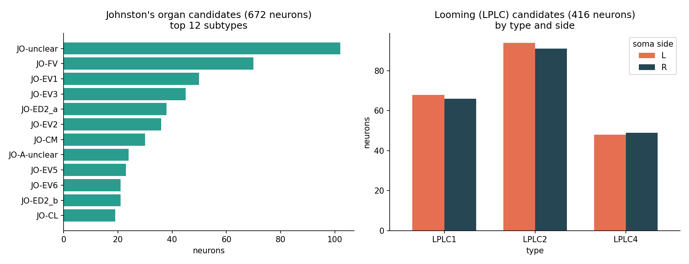
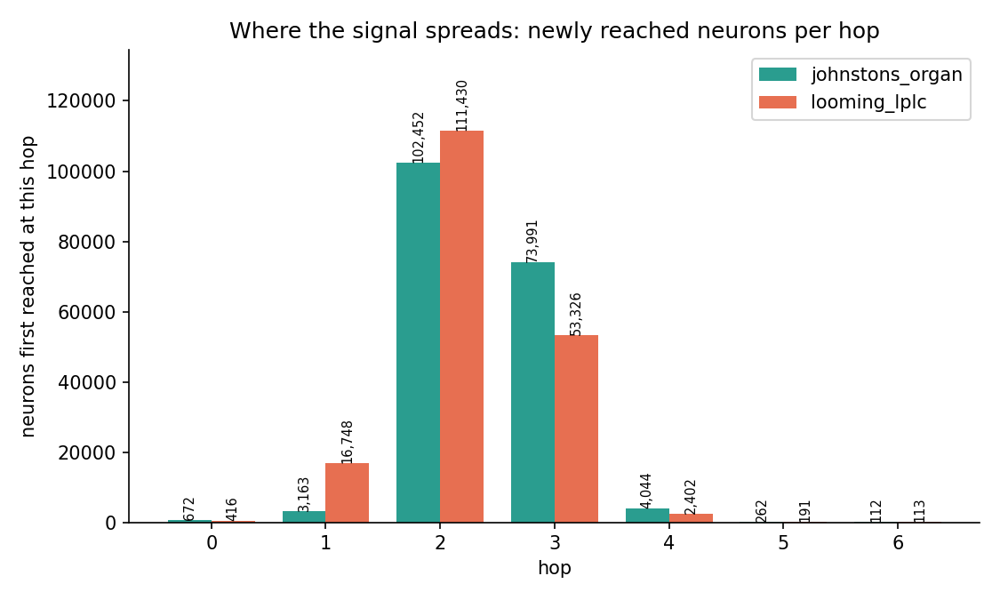
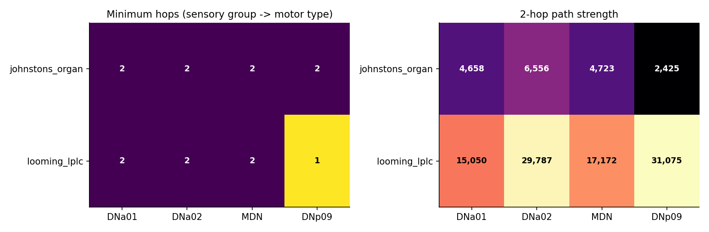
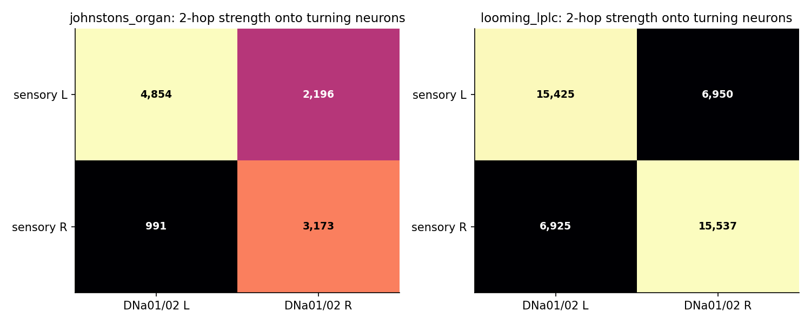
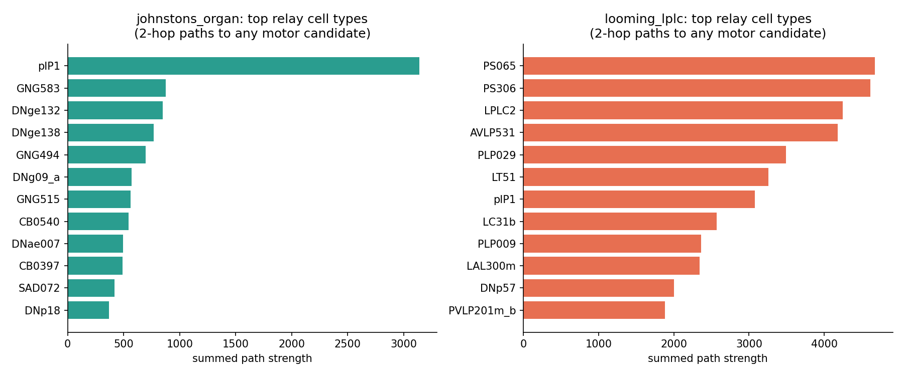
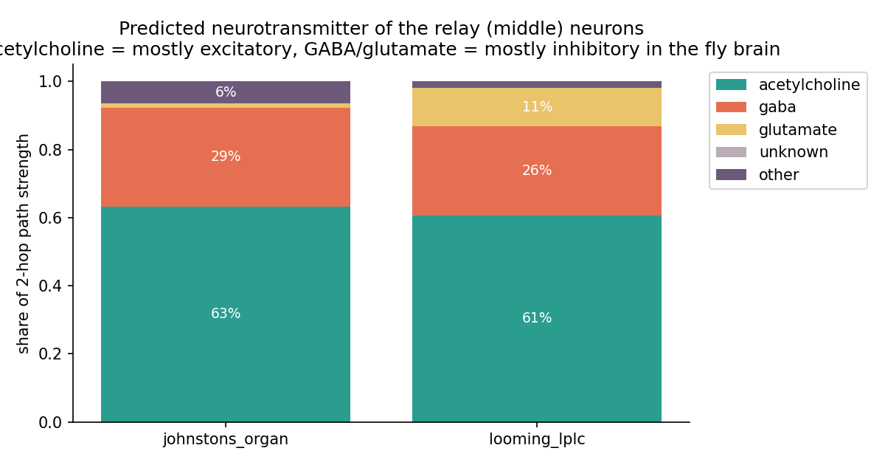

# Static Connectivity Check

Before spending compute on a spiking simulation, this checks a cheaper question first:
**does synaptic wiring even exist between the candidate echo-sensing neurons and the
candidate dodge/motor neurons named in the main [Echo-Fly README](../../README.md#how-it-works)?**

No dynamics, no timing, no leaky integrate-and-fire units. Just breadth-first reachability
over the synaptic connectivity graph, one hop = one synapse, direction-aware
(`body_pre -> body_post`).

Data source: the [Male CNS connectome](https://male-cns.janelia.org/) v1.0 (brain + ventral
nerve cord, CC-BY, Janelia FlyEM), specifically `body-annotations-*.feather` and
`connectome-weights-*.feather` in [`../data/`](../data/).

## Folder layout

```
connectivity-check/
  README.md            this file
  scripts/
    run_check.py       BFS reachability + hop distances + first two graphs
    extra_graphs.py    six extra graphs (strength, left/right, relays, neurotransmitters)
    build_3d.py        interactive 3D anatomical view
  output/
    graphs/            all PNG charts (used in this README)
    data/              CSV candidate lists + JSON results
    3d/                interactive 3D view (brain_paths_3d.html)
```

## Candidates checked

**Sensory** (the two modalities named in the main README as candidate echo inputs):

| Group | Definition | Neurons found |
|---|---|---|
| `johnstons_organ` | every neuron `type` starting with `JO-` (antenna / hearing) | 672 |
| `looming_lplc` | `LPLC1`, `LPLC2`, `LPLC4` (looming-selective visual projection neurons) | 416 |

**Motor** (the movement neurons named in the main README):

| Type | Role | Neurons found | Note |
|---|---|---|---|
| `DNa01` | turning | 2 | |
| `DNa02` | turning | 2 | |
| `MDN` | back up ("moonwalker") | 4 | |
| `DNp09` | walk forward | 2 | aka "P9" in Bidaye et al. 2020; `DNp09` is the hemibrain/MANC name for the same cell type |

## Method

`scripts/run_check.py`:

1. Loads annotations and pulls the candidate `bodyId`s above.
2. Restricts the connectivity graph to edges *between annotated neurons only*. The raw
   `connectome-weights-*.feather` table covers every minconf>=0.5 segment (~88M distinct
   ids), which is overwhelmingly tiny unannotated fragments rather than real, proofread
   neurons — the male CNS has ~212k annotated neurons. Without this filter, hop counts and
   reachable-neuron numbers are dominated by fragment noise; after it, the graph is
   ~26M edges between ~212k real neurons.
3. Runs a multi-source BFS out from each sensory group over that filtered graph, up to
   6 hops, tracking the first hop each neuron is discovered at and one predecessor (for
   path reconstruction).
4. For every (sensory group, motor type) pair, reports whether any of that motor type's
   neurons were reached, at what minimum hop, and one example shortest path.
5. Plots how many distinct neurons become reachable at each hop (`output/graphs/reachability_growth.png`),
   and a diagram of one example shortest path per pair (`output/graphs/shortest_paths.png`).

Edge weight (synapse count) is ignored for hop distance — this only asks "is there a path,"
not "how strong is it." That's the natural next question once we're building the actual
spiking model.

## Results

See [`output/data/hop_distances.json`](output/data/hop_distances.json) for the full machine-readable
result, [`output/data/summary.json`](output/data/summary.json) for the combined summary, and the CSVs
for the full candidate neuron lists with their annotations.

**Headline finding: every candidate motor neuron is reachable from both candidate sensory
groups within 2 hops.**

| Sensory group | -> DNa01 | -> DNa02 | -> MDN | -> DNp09 |
|---|---|---|---|---|
| `johnstons_organ` | 2 hops | 2 hops | 2 hops | 2 hops |
| `looming_lplc` | 2 hops | 2 hops | 2 hops | **1 hop** |

The looming (`LPLC`) group reaches `DNp09` in a single synapse, i.e. some `LPLC` neuron
synapses directly onto a `DNp09` neuron.

`output/graphs/reachability_growth.png` shows the network is a small world: from the ~416-672 seed neurons
in each sensory group, the reachable set is already >100k distinct neurons by hop 2, and
saturates at ~184,600 (of ~212k annotated neurons, so most — but not all — of the brain+VNC
is reachable downstream of these inputs) by hop 4. The practical takeaway: past ~3-4 hops
nearly everything is "reachable from everything," so hop distance only carries real
information in the 1-2 hop range checked here — which is exactly where our motor candidates
landed.

## More graphs, explained

`scripts/extra_graphs.py` adds six charts that go beyond "is there a path" to "how strong, which side,
through whom, and with what sign." Numbers are in [`output/data/extra_summary.json`](output/data/extra_summary.json).

**Terms used below.** A *hop* is one synapse. A *relay* is the middle neuron in a 2-hop path
sensory -> relay -> motor. *Path strength* of one 2-hop path is its weakest link (the smaller of the
two synapse counts), and we sum that over all paths. It is a rough "how much wiring is there"
score, not a firing prediction.

### 1. Who the candidates are — `output/graphs/candidates_breakdown.png`



The Johnston's organ (JO) group is many small subtypes (the `JO-unclear`, `JO-FV`, `JO-EV*` families
are the biggest), so "the antenna input" is really hundreds of neurons of different kinds. The looming
group is three well-defined types (`LPLC1`, `LPLC2`, `LPLC4`) with almost the same number on the left and
right sides, which is what we want for a left/right dodge.

### 2. How the signal spreads — `output/graphs/new_neurons_per_hop.png`, `output/graphs/reachability_growth.png`



Almost nothing is reached at hop 1, over 100,000 neurons are first reached at hop 2, and by hop 4 the
spread has run out. The brain is "small": any input is a couple of synapses from most of it. That is
why only the 1-2 hop range carries information, and why we should not read much into a path merely
existing. What matters is *strength* and *sign*, covered next.

### 3. Minimum hops vs. strength — `output/graphs/hops_and_strength_heatmap.png`



The hop table (left) is the same result as before. The strength table (right) is new and more useful:
the **looming neurons are wired to the motor neurons 3-13x more strongly than the Johnston's organ
neurons** (e.g. 29,787 vs 6,556 onto `DNa02`). Looming to `DNp09` is also the only *direct* connection
(111 synapses, 1 hop). If we have to pick one input for the first demo, looming (vision-like) is the
better-connected choice, and Johnston's organ (hearing-like) is the more "echo-like" but weaker one.

### 4. Left vs. right wiring — `output/graphs/left_right_wiring.png`



For the wall-dodge, *which side* matters. Both sensory groups connect to the turning neurons
(`DNa01`/`DNa02`) mostly **on the same side** (left to left, right to right), at roughly **2x** the
strength of the crossing connections (looming: 15,425 same-side vs 6,950 crossing). So the wiring is
left/right-symmetric enough to build a left/right comparison on. It does **not** yet say whether
same-side input makes the fly turn toward or away from that side, because that depends on
excitation vs. inhibition and needs the simulation. (The Johnston's organ result is lopsided,
left-heavy, which is worth a closer look before we rely on it.)

### 5. Who carries the signal — `output/graphs/top_relay_cell_types.png`



The middle neurons are not random. For hearing, one type, `pIP1`, dominates by far, followed by
`GNG*` (gnathal ganglion) neurons and other descending neurons (`DNge*`). For looming, the strongest
relays are `PS065`, `PS306` (posterior slope), `AVLP531`, `PLP029`, `LT51`, and, interestingly,
`LPLC2` itself, i.e. looming neurons talking to other looming neurons. These are the natural neurons
to include first when we cut a small subnetwork for the simulation.

### 6. Excitatory or inhibitory? — `output/graphs/relay_neurotransmitters.png`



Using the dataset's predicted neurotransmitters, about **60-63%** of the relay strength is
acetylcholine (mostly excitatory in the fly brain), **26-29%** is GABA (mostly inhibitory), and glutamate
(11% for looming) can be inhibitory too. So the paths are a *mix* of "go" and "stop" signals, not one
simple excitatory line. That is a good sign for a brain that has to choose between left and right,
but it also means we cannot guess the net effect from wiring alone.

## 3D view — `output/3d/brain_paths_3d.html`

Open the file in any browser (self-contained, no internet needed). Drag to rotate, scroll to zoom,
click legend entries to hide or show a group, hover the white dots for neuron type and bodyId.

- **Grey haze:** cell bodies of ~45k neurons, which outlines the brain (two optic lobes in the middle
  of the picture) and the ventral nerve cord running up from it.
- **Orange:** looming (LPLC) synapses. They sit in the two optic lobes, where the eyes' signals arrive.
- **Teal:** Johnston's organ synapses, small and central, near the antennal / gnathal region.
- **Lilac:** relay neurons on the strongest paths. **Yellow:** the four motor (descending) neuron types;
  their axons run down the nerve cord toward the legs and wings.
- **Coloured lines:** the 3 strongest sensory -> relay -> motor paths for each motor type and each input
  group (24 paths, listed in `output/data/strongest_paths_3d.csv`), drawn between each neuron's synapse centre.

Positions are real anatomical coordinates (converted to micrometres). Point clouds are randomly
subsampled to keep the page fast, so density is indicative, not exact. The first run of
`scripts/build_3d.py` scans the 13 GB synapse table (a few minutes) and caches the small subset it needs.

## What this does and doesn't tell us

- **Does tell us:** the wiring this project's demo depends on is real, not hypothetical — a
  synaptic path from ear/eye to turn/walk/back-up neurons exists at a very short range. This
  clears the way to attempt the wall-dodge simulation (main README's "First Demo").
- **Doesn't tell us:** whether the *net* effect is excitatory or inhibitory (the neurotransmitter chart shows a mix), whether it's *strong*
  enough to matter next to everything else those motor neurons listen to, or whether driving
  the sensory neurons with synthetic echo input would actually produce a sensible dodge. That
  needs the spiking simulation (next step).

## Reproducing

```bash
pip install -r ../requirements.txt   # run from this folder
python scripts/run_check.py      # BFS, hop distances, first two graphs
python scripts/build_3d.py       # interactive 3D page (first run scans the 13 GB synapse table)
python scripts/extra_graphs.py   # the six extra graphs + extra_summary.json (needs output/data/summary.json from run_check.py)
```

Each takes a few minutes; they scan the ~152M-row connection-weight table.
