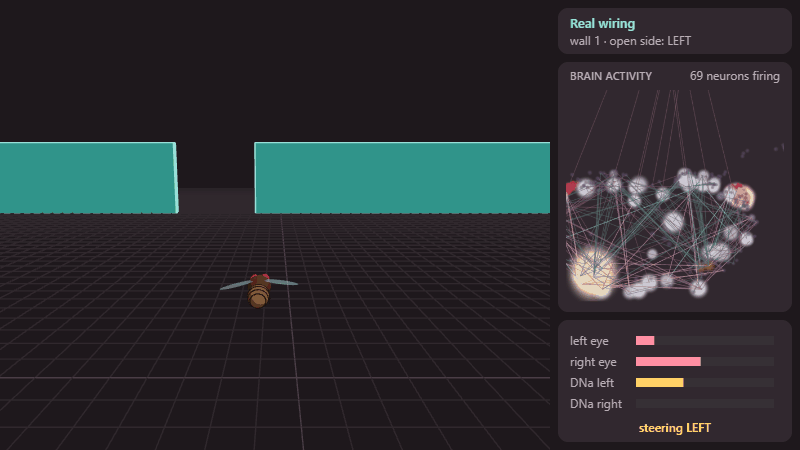
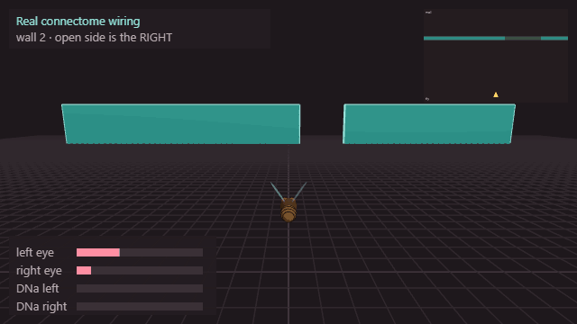
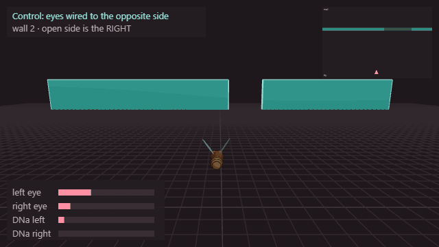
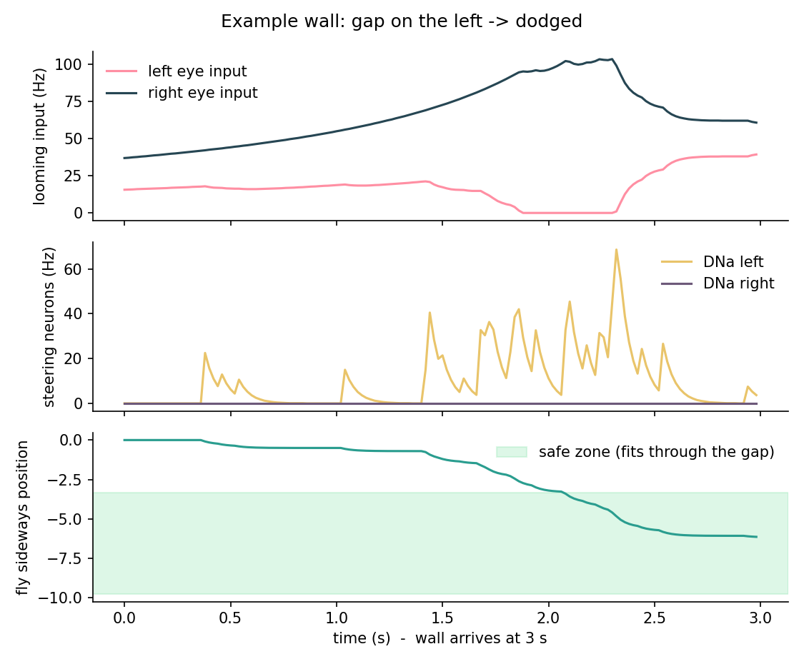
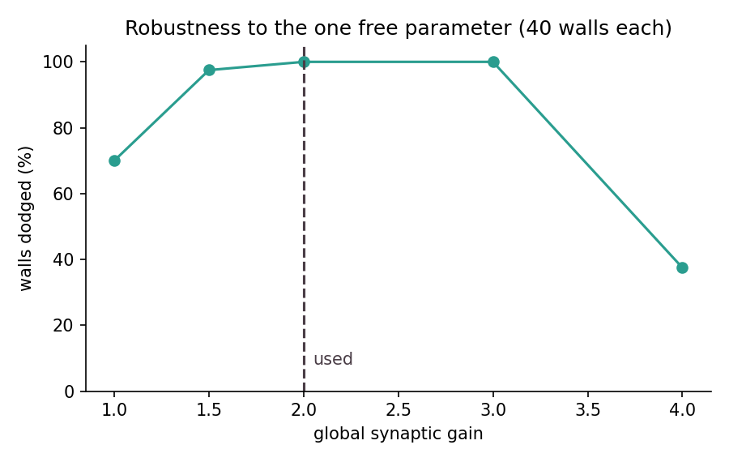

# Wall Dodge: a fly brain steering away from walls

The first demo from the main [Echo-Fly README](../../README.md#first-demo): a fly **stays in place**,
walls **fly at it**, each wall has its **left or right half open**, and the fly can only steer left or
right. The steering is decided by a spiking simulation of a real piece of the male fly connectome.

**Watch it:** open [`output/web/wall_dodge_3d.html`](output/web/wall_dodge_3d.html) in a browser
(needs internet once, to load the three.js library). Pick a condition, replay 12 walls each, orbit with
the mouse. Deep links work too, for example `wall_dodge_3d.html#mode=swapped&trial=2&t=2.5&pause`.

<p align="center">
  
  
  
</p>
<p align="center"><sub>Real wiring dodging to the left and to the right, and the swapped-eye control hitting the wall.</sub></p>

## What happens, step by step

1. **A wall approaches** from 60 units away at 20 units/s (3 seconds). One side of it is open.
2. **Each eye sees looming.** The more solid wall in a fly's left (or right) half of the view, and the
   closer it is, the more strongly that eye's looming neurons are driven (0 to 150 spikes/s).
3. **The brain runs.** 416 looming neurons (LPLC1/2/4, ~half per eye) -> 400 relay neurons -> 4 turning
   neurons (DNa01 and DNa02, one of each per side), joined by the real connections (54k, 336k synapses).
   All 820 neurons are leaky integrate-and-fire units; inputs are Poisson spikes; nothing else is scripted.
4. **The output steers.** Sideways speed = 0.2 units/s per Hz of (right DNa - left DNa) rate.
5. **Score.** When the wall arrives, the fly either fits through the open part (dodged) or not (hit).

Code: [`scripts/build_subnetwork.py`](scripts/build_subnetwork.py) (cut the circuit out of the connectome),
[`scripts/brain.py`](scripts/brain.py) (the neuron model), [`scripts/simulate.py`](scripts/simulate.py)
(the closed loop + all conditions), [`scripts/plot_results.py`](scripts/plot_results.py) and
[`scripts/build_web.py`](scripts/build_web.py) (charts and the 3D page).

## Result


| Condition | What it is | Walls dodged (of 100) |
|---|---|---|
| **real wiring** | the connectome as it is | **100** (95% CI 96-100%) |
| eyes swapped | left eye plugged into the right side of the brain | 0 |
| eyes scrambled | each looming neuron randomly given an eye | 1 |
| no brain | picks a random side | 50 (chance) |

The same walls were used in every row. The swapped-wire row is the control from the main README:
the wiring matters, and it matters *in a specific direction*.

What the real circuit does: more wall on the **right** eye -> the **left** steering neurons fire ->
the fly moves **left**, toward the open side (and mirror-image for the other side).



## Please read before quoting these numbers

- **The "steering direction" is an assumption, and it decides everything.** We assume a DNa neuron
  turns the fly toward *its own* side (reported for DNa02 in the literature). The brain only says which
  side's DNa fires. If the real direction were the opposite, "real wiring" would score ~0% and
  "swapped" ~100%. So the honest claim is: *given that assumption, the real wiring is arranged so that
  the fly turns away from the side with more wall.* We did not test the assumption.
- **A "dodge" is very generous.** The whole left or right half of the wall is open, so it is a
  left/right choice, not fine steering. The score is 100% because that choice is easy here, not because
  the fly is a great pilot.
- **One number was chosen to make the small circuit work: the global gain (2.0).** The circuit is
  820 of ~200,000 neurons, so its synapses were multiplied by one constant. It is the same for every
  connection and every condition; it was never tuned per side. Robustness:

  

  It works from about 1.5 to 3 (97-100%), is weaker at 1 (70%) and breaks at 4 (37%, the circuit
  over-excites). So it is a working window, not a knife-edge, but it is not free either.
- **The relay set (top 400 by 2-hop strength) and the readout (2 neurons per side) are our choices.**
  We did not check other sizes.
- **The looming input is a hand-made stand-in** for what real eyes would send, not an echo/sonar signal
  yet. The sonar is the real project goal; this shows the brain side of the loop works with a simple input.
- **Neuron parameters are recalled from Shiu et al. 2024** (values in [`brain.py`](scripts/brain.py)) and
  are approximate. Neurotransmitter signs are the dataset's predictions (acetylcholine +, GABA and
  glutamate -, everything else treated as excitatory).
- **No body physics.** The fly is a point that slides sideways. Wing flapping in the 3D page is only for looks.

## Reproduce

```bash
python scripts/build_subnetwork.py   # ~1 min, reads ../data
python scripts/simulate.py 100       # ~3 min, 100 walls x 4 conditions + gain sweep
python scripts/plot_results.py
python scripts/build_web.py          # bakes the recording into output/web/wall_dodge_3d.html
python scripts/capture_gifs.py --open  # optional: records the GIFs in output/gifs (needs Pillow; uses your browser)
```

## Ideas for next steps

- Replace looming with an echo-like input (five sonar beams, distance -> strength) and compare.
- Try Johnston's organ as the input, and repeat with a random / shuffled subnetwork as a stronger control.
- Test the steering-direction assumption against what is known about DNa01/DNa02.
- Move to a narrower gap so the fly has to steer precisely, and to the building-escape test.
