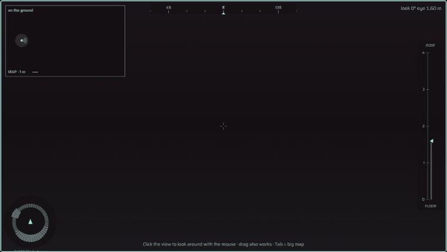
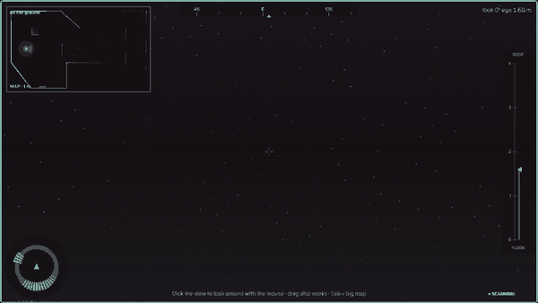
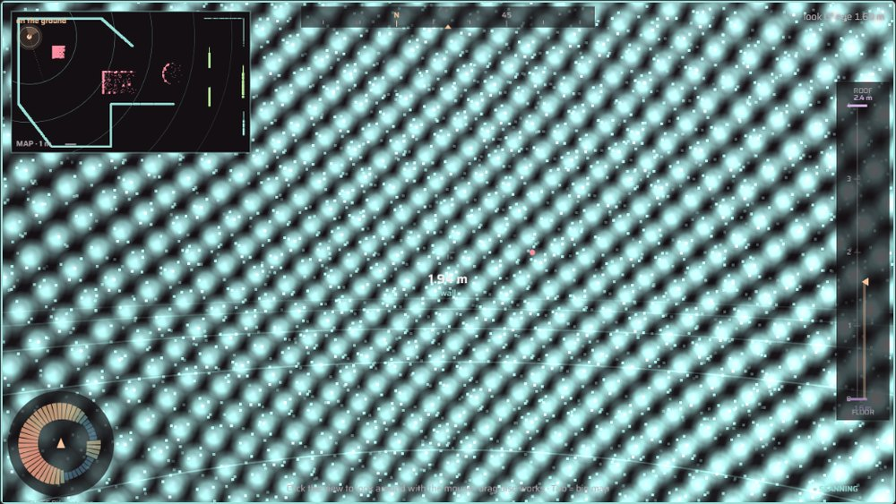
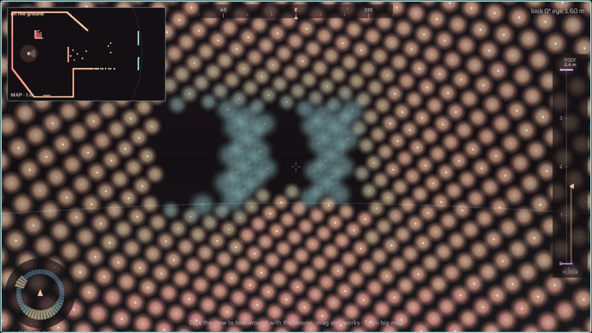
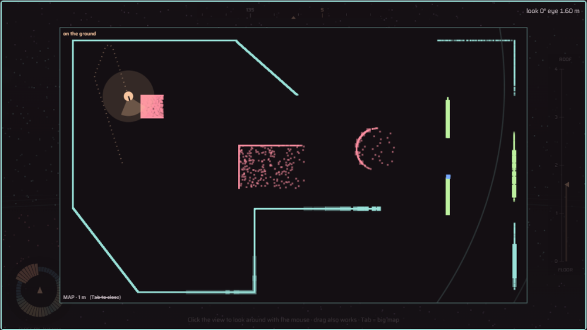
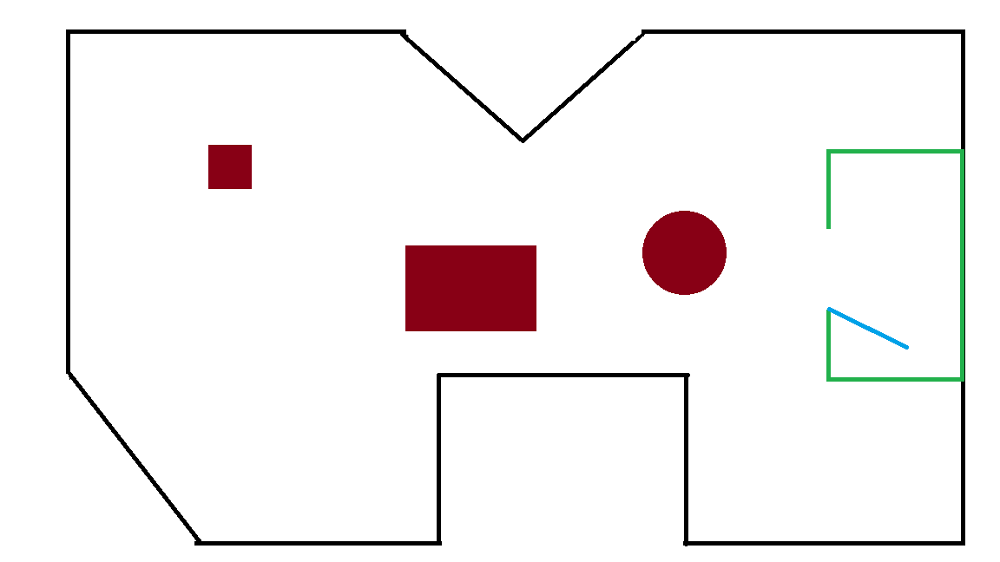
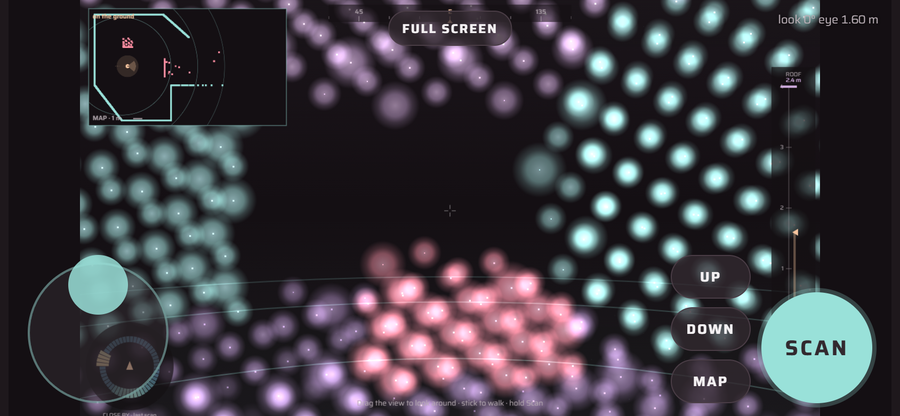
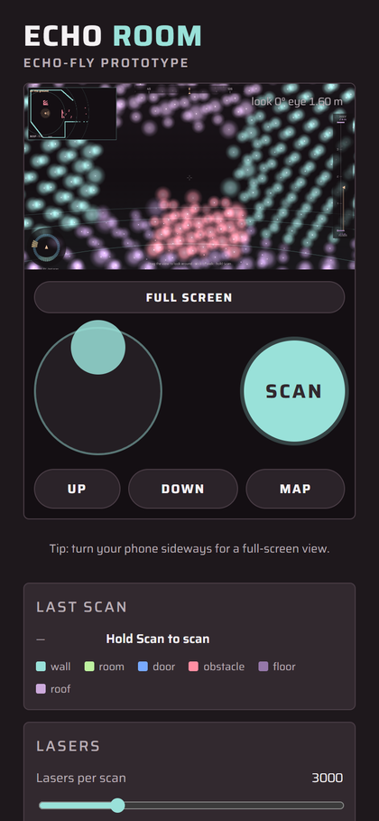

  

> [!WARNING]
> **Echo-Fly is in the earliest of the earliest stages of development.** Nothing is built yet. Everything below is a plan, and plans change. None of it has been tested, so treat all of it as *"we think"*, *"we hope"* and *"we'll see"*.

  

  
  &nbsp;&nbsp;
  
  &nbsp;&nbsp;
  
  &nbsp;&nbsp;
  

  
  
  
  
  

Planned tools. This could change once we actually start building.

 

  
  
  
  
  
  
  
  
  
  

 

**Echo-Fly** is an 11th grade project by four students from **UKTC** (Pravets, Bulgaria).

The short version: we want to build a **simulated echolocator** (a sonar, like a bat uses) and try to plug it into a **simulation of a real fruit fly brain**. Then we'll see if that brain can do anything useful with it, like dodging walls or finding a way out of a building.

Everything happens on a computer: no hardware, no real flies. We don't know yet if it will work. Finding out is the point of the project.

In 2024 the **FlyWire** project published a complete map of an adult fruit fly (*Drosophila*) brain: about **140,000 neurons** and **tens of millions of connections**. Google Research helped with the AI that traced the neurons. Scientists have since built simple computer models of that whole brain that can run on a normal laptop.

But **fruit flies can't echolocate.** Nothing in their brain was built for sonar.

So our question is roughly:

> *If we feed sonar "echoes" into a real fly brain's wiring through senses it already has, does the brain respond in a way that makes sense, or is it just noise?*

We honestly don't know the answer, and it could easily be "noise". That's still a result.

  

The plan (subject to change) is a loop:

1. **Virtual world.** A simple 2D world with walls in it.
2. **Sonar ping.** The fly sends out a few "beams" (left, front-left, front, front-right, right) and measures how far each one travels before it hits something. Closer wall = stronger echo.
3. **Sensory neurons.** Echo strength becomes activity in fly sensory neurons. We're still choosing which ones. Current candidates are the **antenna / hearing** neurons (Johnston's organ) or the **"looming"** neurons that detect things rushing at the eyes.
4. **Fly connectome.** Run the brain simulation for a short moment.
5. **Motor neurons.** Read the neurons known to be involved in movement. The candidates so far are turning (e.g. **DNa01 / DNa02**), walking forward (**P9**) and backing up (**MDN**, the "moonwalker" neuron).
6. **Move, then ping again.**

> [!NOTE]
> **Not built yet.** The demo is at the idea-on-paper stage, the very earliest step. The picture below shows what we're aiming for, not a result.

  

**The quick version:** the fly **stays in place** and walls **fly at it**. Each wall has a **gap on the left or the right**. The fly can only do one thing: **dodge left or dodge right**.

- The side with the wall sends back **strong echoes**. The gap side sends back **weak ones**.
- Those echoes go into the fly brain's left/right sensory neurons.
- We compare the **left-turn vs right-turn** neurons. Whichever is more active is the dodge.
- Dodged toward the gap = ✅ &nbsp; Otherwise = 💥

**What we'd hope to measure:**

| Idea | Why |
|---|---|
| Accuracy over many walls | Random guessing gets ~50%. Anything clearly above that *might* mean the wiring is using the sonar. |
| Swapped-wire control | Plug the left echo into the right side of the brain. If accuracy drops, that *could* show the wiring is what matters. |
| Wall speed, gap size, sonar noise | Change one thing at a time and see what happens to accuracy. |

The fly brain might always pick the same side, or might do something we don't expect at all. If that happens, we'll try other sensory neurons and compare.

Only if the first demo goes somewhere. The fly is placed **blind inside a building (a maze)** and has to find its way out using only the echolocator.

- Dodging walls alone probably won't find the exit, so the exit might give off a **"smell"** (fresh air) that gets stronger as the fly gets closer, feeding the fly's odor neurons.
- We'd compare the connectome-driven fly against a **randomly moving fly** to see if the real brain wiring helps at all.
- Stretch goal, *if* there's time: move from 2D to a 3D fly body using **NeuroMechFly / FlyGym**.

> [!NOTE]
> **Very early prototype.** This is a first experiment with the echolocator only. It is **not connected to the fly brain** yet, and it will probably change a lot or get rewritten.

[`RayCastV1/`](RayCastV1/) is **Echo Room**, a first-person sonar you can play in the browser. The walls are invisible. Every scan fires thousands of rays, and a spot only lights up briefly when its echo comes back. It's a rough idea of what the world might "look like" to our blind fly in **Test 2**.

  

<b>One ping.</b> Nothing is visible until the echoes come back. Near hits light up first, far ones later. (Echo speed turned down so you can see the wave.)

  

<b>Scanning while moving.</b> Holding scan, turning, then walking toward a wall. The minimap in the corner fills in with what the sonar has found.

<table>
  <tr>
    <td width="50%"></td>
    <td width="50%"></td>
  </tr>
  <tr>
    <td align="center">Colored by <b>what it hit</b>: turquoise = wall, pink = obstacle, green = room wall, purple = floor / roof</td>
    <td align="center">Colored by <b>distance</b> (<kbd>C</kbd>): warm = close, turquoise / blue = far</td>
  </tr>
  <tr>
    <td width="50%"></td>
    <td width="50%"></td>
  </tr>
  <tr>
    <td align="center"><b>Big map</b> (<kbd>Tab</kbd>): everything the sonar has hit so far, plus the path walked</td>
    <td align="center"><b>The real level</b>: black = walls (4 m), green = room walls, blue = door, red = low obstacles (0.8 m)</td>
  </tr>
</table>

<table>
  <tr>
    <td width="68%"></td>
    <td width="32%"></td>
  </tr>
  <tr>
    <td align="center"><b>Phone, sideways:</b> full screen with the walk stick, Up / Down / Map and Scan on top</td>
    <td align="center"><b>Phone, upright:</b> controls under the view</td>
  </tr>
</table>

Recorded from the prototype as it is now. It will probably look different later.

**Play it:** [https://izu83.github.io/Echo-Fly/RayCastV1/](https://izu83.github.io/Echo-Fly/RayCastV1/), on a computer or a phone. You can also download the repo and open [`RayCastV1/index.html`](RayCastV1/index.html) directly.

- **Computer:** click the view, look around with the mouse, hold **E** (or left click) to scan, walk with **W A S D**, and press **Tab** for the map.
- **Phone:** turn it sideways, drag to look, use the left stick to walk, and hold **Scan**.

The full controls are in [`RayCastV1/README.md`](RayCastV1/README.md).

**What might come next:** right now a human is driving. The idea is to eventually swap the human for the fly brain, turning echoes into sensory-neuron input and letting the fly's motor neurons do the walking and turning. That's still a big "if".

- [x] Pick an idea we're excited about
- [x] Plan the two tests
- [ ] Get an existing whole-brain fly model running and reproduce one of its published results
- [x] First echolocator prototype ([Echo Room](#prototype), human-controlled for now)
- [ ] Build the wall + sonar simulation
- [ ] Connect them for a single wall / single trial
- [ ] Run many trials + the swapped-wire control
- [ ] *(Maybe)* Building escape
- [ ] Graphs, video, poster

To be upfront about what this is and isn't:

- **This is not a fly that echolocates.** At best it's a real fly brain map *reacting* to a made-up sense.
- **The brain model is very simplified.** The models we plan to use treat every neuron as a basic "leaky integrate-and-fire" unit. Real neurons are much more complicated.
- **The connectome is only the brain.** It doesn't include the body or the rest of the nervous system the same way, so movement outputs are an approximation.
- **Probably not real time.** Simulating ~140k neurons takes a moment per step, so results will likely be recorded and replayed.
- **We're students.** We're learning as we go, and some of what's written here may turn out to be wrong.

| Name | GitHub |
|---|---|
| **Nikolay Rangelov** | [@Izu83](https://github.com/Izu83) |
| **Kiril Borisov** | [@KikarrA](https://github.com/KikarrA) |
| **Ivan Damiankin** | [@IvanDD916](https://github.com/IvanDD916) |
| **Mitko Totev** | [@miti0o0](https://github.com/miti0o0) |

From **UKTC**, the Vocational High School of Computer Technologies and Systems in Pravets, Bulgaria: [uktc-bg.com](https://uktc-bg.com)

This project would be impossible without other people's work:

- **FlyWire Consortium**, for the whole-brain fruit fly connectome ([flywire.ai](https://flywire.ai)). Dorkenwald et al., *"Neuronal wiring diagram of an adult brain"*, Nature (2024), and Schlegel et al., *"Whole-brain annotation and multi-connectome cell typing of Drosophila"*, Nature (2024).
- **Google Research**, for the AI-based neuron reconstruction behind the map.
- **Shiu et al.**, *"A Drosophila computational brain model reveals sensorimotor processing"*, Nature (2024), for showing a whole fly brain can be simulated on a laptop.
- **NeuroMechFly / FlyGym** (EPFL), for the simulated fly body we might use later.
- **UKTC** and our teachers.

 

README graphics are generated by <code>tools/build_readme_assets.py</code>. Edit it and re-run to change them.

