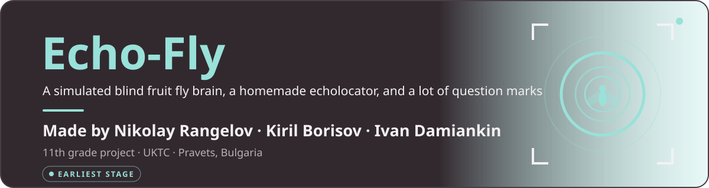
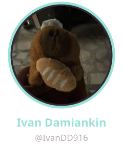
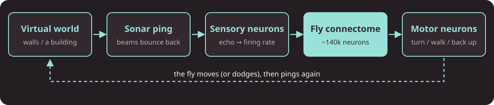
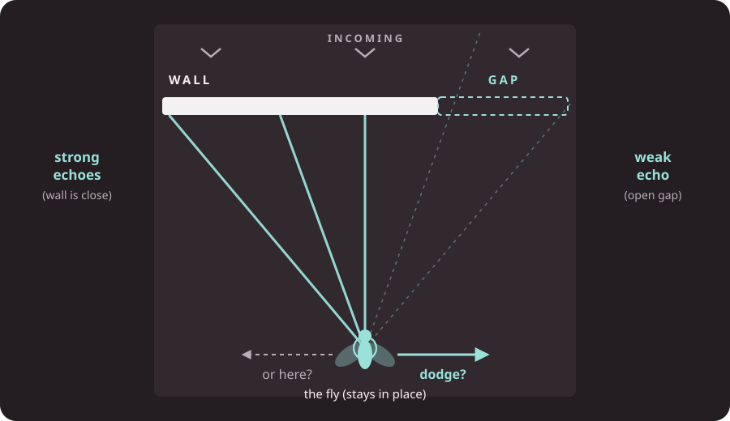
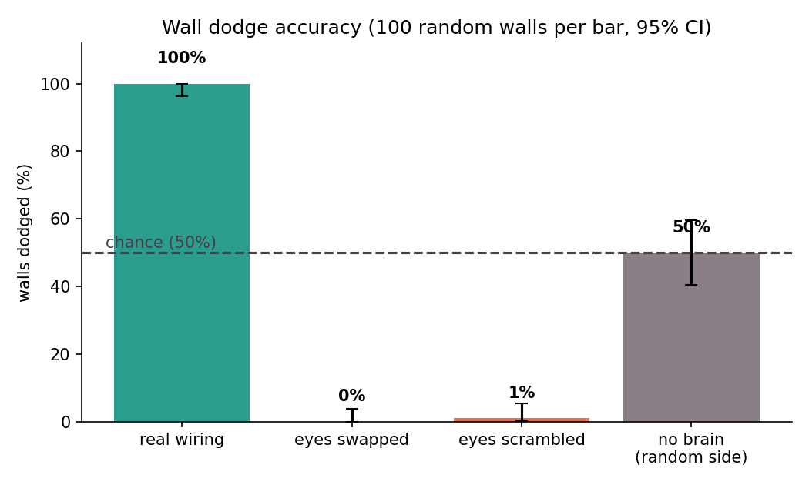

<p align="center">
  
</p>

> [!WARNING]
> **Echo-Fly is still early, and everything here comes with caveats.** So far we have a check of the fly connectome's wiring, a first spiking wall-dodge simulation driven by a simple *looming* input, and a browser sonar prototype. We do **not** have the sonar wired into the fly brain yet. The results come from a small simulated circuit and rest on stated assumptions, so read them as *"promising"*, not *"proven"*.

<p align="center">
  <a href="https://uktc-bg.com"></a>
</p>

<p align="center">
  <a href="https://github.com/Izu83"></a>
  &nbsp;&nbsp;
  <a href="https://github.com/KikarrA"></a>
  &nbsp;&nbsp;
  <a href="https://github.com/IvanDD916"></a>
  &nbsp;&nbsp;
  <a href="https://github.com/miti0o0"></a>
</p>

<p align="center">
  
  
  
  
  
</p>
<p align="center"><sub>Python, NumPy and Matplotlib are in use. Brian2 is still planned: our simulator so far is a small NumPy model. The data is the male CNS connectome from Janelia FlyEM.</sub></p>

<br>


<p align="center">
  <a href="#about"></a>
  <a href="#the-idea"></a>
  <a href="#how-it-works"></a>
  <a href="#first-demo"></a>
  <a href="#test-2"></a>
  <a href="#roadmap"></a>
  <a href="#limitations"></a>
  <a href="#team"></a>
  <a href="#thanks"></a>
</p>

<br>

<a name="about"></a>


**Echo-Fly** is an 11th grade project by four students from **UKTC** (Pravets, Bulgaria).

The short version: we want to build a **simulated echolocator** (a sonar, like a bat uses) and try to plug it into a **simulation of a real fruit fly brain**. Then we'll see if that brain can do anything useful with it, like dodging walls or finding a way out of a building.

Everything happens on a computer: no hardware, no real flies. We don't know yet if it will work. Finding out is the point of the project.

<a name="the-idea"></a>


In 2024 the **FlyWire** project published a complete map of an adult fruit fly (*Drosophila*) brain: about **140,000 neurons** and **tens of millions of connections**. Google Research helped with the AI that traced the neurons. Scientists have since built simple computer models of that whole brain that can run on a normal laptop.

But **fruit flies can't echolocate.** Nothing in their brain was built for sonar.

So our question is roughly:

> *If we feed sonar "echoes" into a real fly brain's wiring through senses it already has, does the brain respond in a way that makes sense, or is it just noise?*

We honestly don't know the answer, and it could easily be "noise". That's still a result.

<a name="how-it-works"></a>


<p align="center">
  
</p>

The plan (subject to change) is a loop:

1. **Virtual world.** A simple 2D world with walls in it.
2. **Sonar ping.** The fly sends out a few "beams" (left, front-left, front, front-right, right) and measures how far each one travels before it hits something. Closer wall = stronger echo.
3. **Sensory neurons.** Echo strength becomes activity in fly sensory neurons. We're still choosing which ones. Current candidates are the **antenna / hearing** neurons (Johnston's organ) or the **"looming"** neurons that detect things rushing at the eyes.
4. **Fly connectome.** Run the brain simulation for a short moment.
5. **Motor neurons.** Read the neurons known to be involved in movement. The candidates so far are turning (e.g. **DNa01 / DNa02**), walking forward (**P9**) and backing up (**MDN**, the "moonwalker" neuron).
6. **Move, then ping again.**

<a name="first-demo"></a>


> [!NOTE]
> **First version built, with a stand-in input.** The wall-dodge simulation runs, but it is driven by a simple *looming* signal instead of sonar echoes. The sketch below is the original plan; the results in [What we've built so far](#what-weve-built-so-far) are from what we actually ran.

<p align="center">
  
</p>

**The quick version:** the fly **stays in place** and walls **fly at it**. Each wall has a **gap on the left or the right**. The fly can only do one thing: **dodge left or dodge right**.

- The side with the wall sends back **strong echoes**. The gap side sends back **weak ones**.
- Those echoes go into the fly brain's left/right sensory neurons.
- We compare the **left-turn vs right-turn** neurons. Whichever is more active is the dodge.
- Dodged toward the gap = ✅ &nbsp; Otherwise = 💥

**What we'd hope to measure:**

| Idea | Why |
|---|---|
| Accuracy over many walls | Random guessing gets ~50%. Anything clearly above that *might* mean the wiring is using the sonar. |
| Swapped-wire control | Plug the left echo into the right side of the brain. If accuracy drops, that *could* show the wiring is what matters. |
| Wall speed, gap size, sonar noise | Change one thing at a time and see what happens to accuracy. |

The fly brain might always pick the same side, or might do something we don't expect at all. If that happens, we'll try other sensory neurons and compare.

### What we've built so far

**1. A wiring check** ([`BrainTest1/connectivity-check`](BrainTest1/connectivity-check/)). Before simulating anything, we asked whether the candidate input neurons are wired to the candidate movement neurons at all, using the [male CNS connectome](https://male-cns.janelia.org/) (211,577 neurons, brain plus nerve cord). They are: the looming neurons (LPLC) and the hearing neurons (Johnston's organ) reach the turning, walking and backing-up neurons in **2 synapses or fewer**, and looming reaches the walking neuron **DNp09** directly. There are charts and a plain-language write-up in that folder.

**2. A wall-dodge simulation** ([`BrainTest1/wall-dodge`](BrainTest1/wall-dodge/)). We cut an 820-neuron circuit out of the connectome (looming inputs, 400 relay neurons, the DNa turning neurons), simulated it as leaky integrate-and-fire neurons, and closed the loop with walls flying at a fly. The fly steers by the difference between its left and right turning neurons. Result over 100 random walls per condition:

| Condition | Walls dodged (of 100) |
|---|---|
| Real fly wiring | **100** |
| Left and right eye swapped (control) | 0 |
| Eyes randomly scrambled (control) | 1 |
| No brain, random side | 50 |

<p align="center">
  
</p>

There is an interactive 3D version with a flapping fly and a flying wall: download [`wall_dodge_3d.html`](BrainTest1/wall-dodge/output/web/wall_dodge_3d.html) and open it in a browser (it needs internet once to load the three.js library).

> [!IMPORTANT]
> **How much to trust this.** The dodge direction depends on an assumption we did not test: that a DNa neuron turns the fly toward its own side. With the opposite assumption the real-wiring and swapped-wire results would trade places. The task is also easy (a whole half of the wall is open), and one global synaptic gain was set so the small circuit works (it works from about 1.5 to 3, and breaks at 4). Details and the full list of caveats are in [`wall-dodge/README.md`](BrainTest1/wall-dodge/README.md).

**3. Echo Room** ([`RayCastV1`](RayCastV1/)). A first-person laser-sonar prototype that runs in a browser (open `RayCastV1/index.html`, on a computer or a phone). It is the sonar side of the project; it is not connected to the fly brain yet.

### Run it yourself

The connectome tables are about 23 GB, so they are not in this repository. The download script fetches them from Janelia (with `--core` it skips the three largest files, which the simulation does not need):

```bash
pip install -r BrainTest1/requirements.txt
python BrainTest1/download_data.py --core
python BrainTest1/wall-dodge/scripts/build_subnetwork.py
python BrainTest1/wall-dodge/scripts/simulate.py 100
python BrainTest1/wall-dodge/scripts/build_web.py
```

More detail is in [`BrainTest1/README.md`](BrainTest1/README.md).

<a name="test-2"></a>


Only if the first demo goes somewhere. The fly is placed **blind inside a building (a maze)** and has to find its way out using only the echolocator.

- Dodging walls alone probably won't find the exit, so the exit might give off a **"smell"** (fresh air) that gets stronger as the fly gets closer, feeding the fly's odor neurons.
- We'd compare the connectome-driven fly against a **randomly moving fly** to see if the real brain wiring helps at all.
- Stretch goal, *if* there's time: move from 2D to a 3D fly body using **NeuroMechFly / FlyGym**.

<a name="roadmap"></a>


- [x] Pick an idea we're excited about
- [x] Plan the two tests
- [x] Get the male fly connectome and check that input and movement neurons are wired together
- [ ] Get an existing whole-brain fly model running and reproduce one of its published results *(we wrote our own small model instead, so this is still open)*
- [x] Build the wall simulation *(with a looming input)*
- [x] Connect it to the fly circuit for a single wall / single trial
- [x] Run many trials + the swapped-wire control *(with a looming input)*
- [x] Browser sonar prototype (Echo Room)
- [ ] Replace the looming input with sonar echoes and wire it into the fly brain
- [ ] Test the steering-direction assumption and stronger controls
- [ ] *(Maybe)* Building escape
- [ ] Graphs, video, poster *(first graphs and a 3D replay exist)*

<a name="limitations"></a>


To be upfront about what this is and isn't:

- **This is not a fly that echolocates.** At best it's a real fly brain map *reacting* to a made-up sense.
- **The brain model is very simplified.** Every neuron is a basic "leaky integrate-and-fire" unit, and our simulation uses only about 820 neurons cut out of the connectome, not the whole brain. Real neurons are much more complicated.
- **The input is not sonar yet.** The wall-dodge results use a hand-made looming signal. Whether sonar echoes work the same way is the open question of the project.
- **The steering direction is an assumption.** We assume a DNa neuron turns the fly toward its own side. We have not tested it, and the result depends on it.
- **The connectome is only the brain.** It doesn't include the body or the rest of the nervous system the same way, so movement outputs are an approximation.
- **Recorded, not real time.** Our small circuit is fast, but the full connectome would not be. Results are recorded and replayed in the 3D page.
- **We're students.** We're learning as we go, and some of what's written here may turn out to be wrong.

<a name="team"></a>


| Name | GitHub |
|---|---|
| **Nikolay Rangelov** | [@Izu83](https://github.com/Izu83) |
| **Kiril Borisov** | [@KikarrA](https://github.com/KikarrA) |
| **Ivan Damiankin** | [@IvanDD916](https://github.com/IvanDD916) |
| **Mitko Totev** | [@miti0o0](https://github.com/miti0o0) |

From **UKTC**, the Vocational High School of Computer Technologies and Systems in Pravets, Bulgaria: [uktc-bg.com](https://uktc-bg.com)

<a name="thanks"></a>


This project would be impossible without other people's work:

- **FlyWire Consortium**, for the whole-brain fruit fly connectome ([flywire.ai](https://flywire.ai)). Dorkenwald et al., *"Neuronal wiring diagram of an adult brain"*, Nature (2024), and Schlegel et al., *"Whole-brain annotation and multi-connectome cell typing of Drosophila"*, Nature (2024).
- **Google Research**, for the AI-based neuron reconstruction behind the map.
- **Shiu et al.**, *"A Drosophila computational brain model reveals sensorimotor processing"*, Nature (2024), for showing a whole fly brain can be simulated on a laptop. Our neuron settings follow theirs (from memory, so approximately).
- **Janelia FlyEM and the Male CNS connectome team**, for the male brain and nerve cord connectome we use ([male-cns.janelia.org](https://male-cns.janelia.org/), licensed CC-BY).
- **NeuroMechFly / FlyGym** (EPFL), for the simulated fly body we might use later.
- **UKTC** and our teachers.

<br>

<p align="center"><sub>README graphics are generated by <code>tools/build_readme_assets.py</code>. Edit it and re-run to change them.</sub></p>
