<p align="center">
  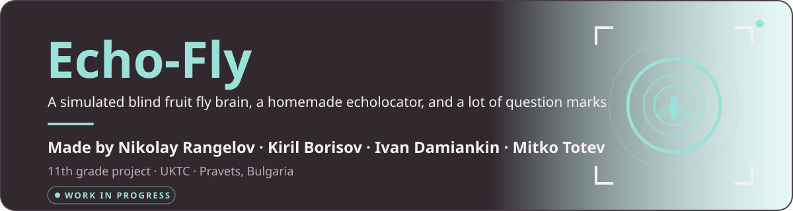
</p>

<a name="team"></a>


<p align="center">
  <a href="https://github.com/Izu83"></a>
  &nbsp;&nbsp;
  <a href="https://github.com/KikarrA">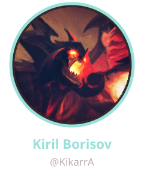</a>
  &nbsp;&nbsp;
  <a href="https://github.com/IvanDD916">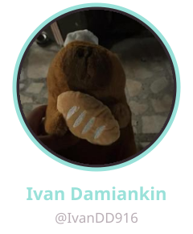</a>
  &nbsp;&nbsp;
  <a href="https://github.com/miti0o0"></a>
</p>

<p align="center">
  <a href="https://uktc-bg.com"></a><br>
  <sub>11th grade project · The Vocational High School of Computer Technologies and Systems, Pravets, Bulgaria</sub>
</p>

<p align="center">
  <b>We took a piece of a real fruit fly's brain map, simulated it on a computer and let it drive a virtual fly.</b><br>
  Can it dodge walls? Find its way? Learn? And one day: can it use sonar, like a bat?
</p>

<p align="center">
  
  
  
  
  
</p>

<p align="center">
  <a href="#what-is-this"></a>
  <a href="#what-weve-built"></a>
  <a href="#how-it-works"></a>
  <a href="#try-it"></a>
  <a href="#where-were-going"></a>
  <a href="#limitations"></a>
  <a href="#thanks"></a>
</p>

<br>

<p align="center">
  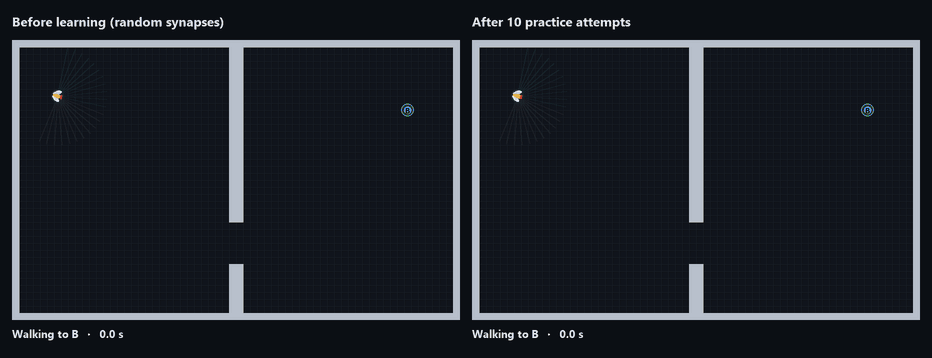
</p>
<p align="center"><sub>The same fly brain, before learning (left) and after 10 practice attempts (right). It has to walk from A to B, through the gap in the wall.</sub></p>

<a name="what-is-this"></a>


**Echo-Fly** is an 11th grade project by the four of us at **UKTC** in Pravets, Bulgaria.

Scientists have mapped **every neuron and every connection** in the brain and nerve cord of a fruit fly. That map
is called a *connectome*. We cut a small piece out of it (820 neurons), simulate those neurons on a computer and
connect them to a virtual fly. Nothing about "how to steer" is written in our code: the fly's own wiring decides.

Our big goal is to give the fly a sense it doesn't have: **sonar**, like a bat. Fruit flies can't echolocate, so
the question is whether a real fly brain can make sense of it at all. We're not there yet. For now the fly
steers with its eyes, which is the step before.

> [!NOTE]
> Everything here runs on a computer: no real flies, no hardware. The brain model is simplified and the results
> rest on assumptions we state below, so read them as *"promising"*, not *"proven"*.

<a name="what-weve-built"></a>


<p align="center"></p>

Before simulating anything, we checked the map. Can a signal from the fly's **eyes** (the *looming* neurons that
react when something rushes at the fly) or its **ears** (the hearing neurons in the antenna, *Johnston's organ*)
reach the neurons that make a fly **turn, walk or back up**?

<p align="center">
  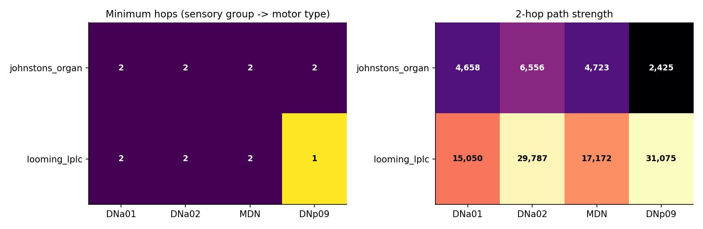
</p>

**Yes, and very directly.** Every one of them is only **1 or 2 synapses** away (left). The eyes have many more of
those short paths than the ears (right), which is why we started with the eyes.
[More in the wiring check →](experiments/connectivity-check/)

<p align="center">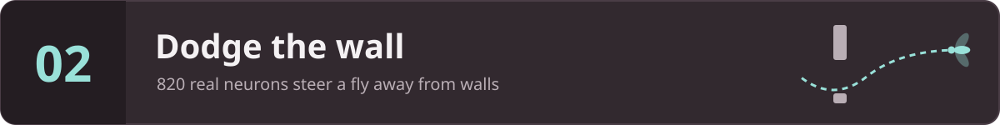</p>

The fly stays in place and walls fly at it. Each wall is open on the left or the right, and the fly has to move to
the open side. On the right of each clip you see the 820 neurons, drawn where they sit in the brain and flashing
when they fire.

<p align="center">
  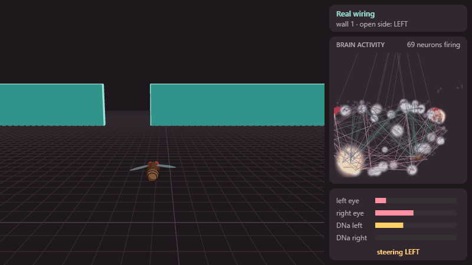
  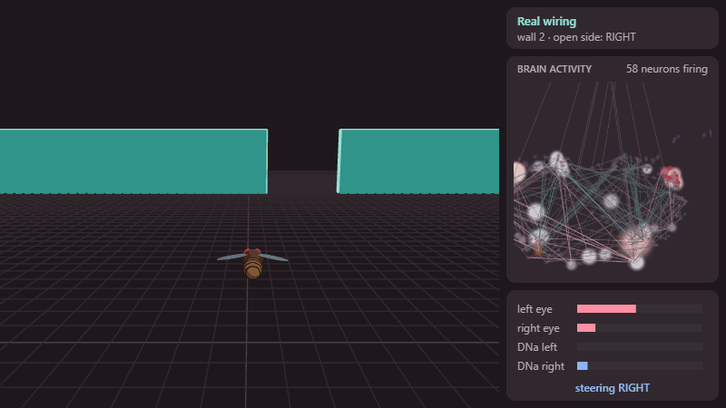
</p>
<p align="center">
  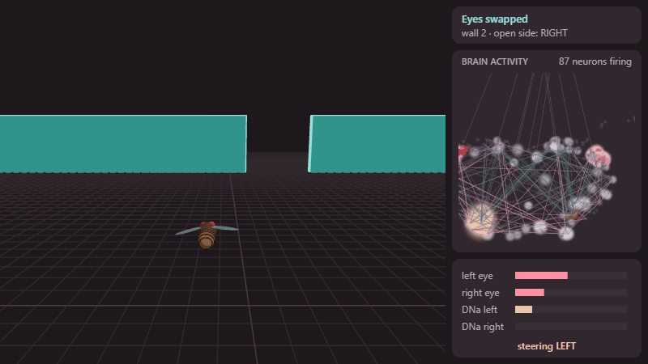
  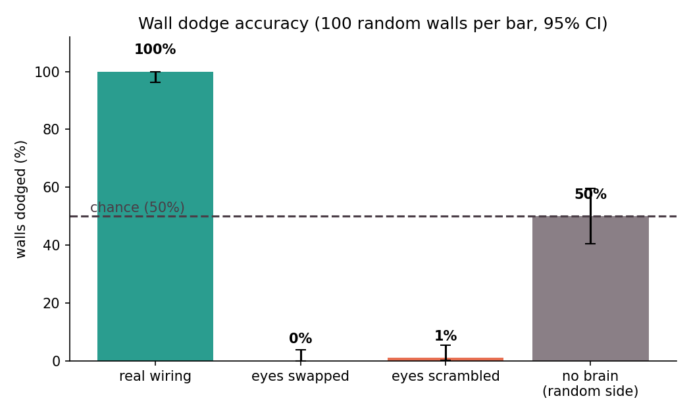
</p>

- **With its real wiring**, the fly dodged **100 of 100** walls.
- **With the eyes plugged into the wrong side** of the brain, it dodged **0** (bottom left). So the wiring is what
  does the steering.
- A fly with no brain, picking a side at random, gets about 50.

[More in wall-dodge →](experiments/wall-dodge/) · the 3D replay, [`wall_dodge_3d.html`](experiments/wall-dodge/output/web/wall_dodge_3d.html), works offline in a browser.

<p align="center">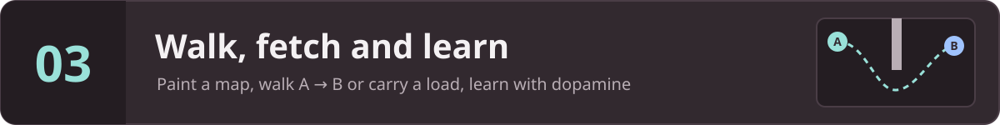</p>

Next we gave the same brain a whole world to walk around in: a 2D map **you paint yourself**. There are two
separate tasks:

- **Walk A → B.** Walk from the start to the goal.
- **Carry.** Walk to a load, pick it up and carry it to the drop-off point.

<p align="center">
  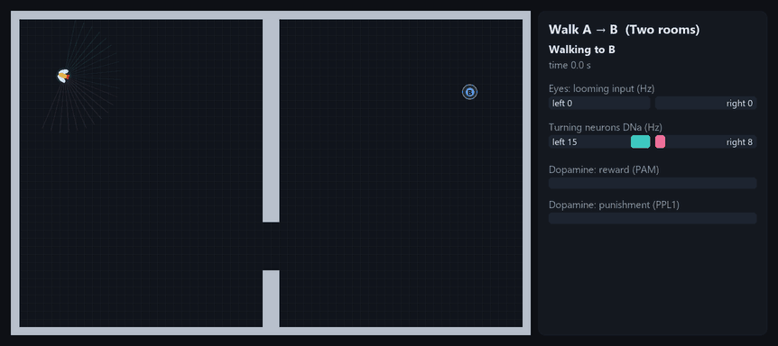
  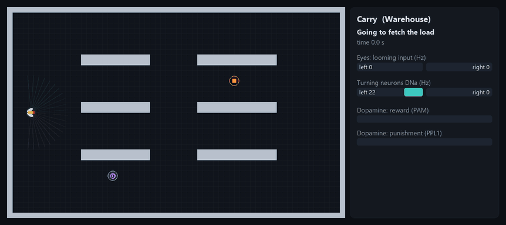
</p>

How it works, simply:

1. **The fly always walks forward.** The only thing its brain decides is which way to turn.
2. **Its eyes** (the coloured lines) see the walls. The closer a wall, the harder the eye's looming neurons fire.
3. **The brain** passes that on to the **turning neurons**. If the right ones fire more, the fly turns right.
   That alone is enough to steer around walls.
4. **To find the goal it has to learn**, using **dopamine**, the same "reward" chemical real brains use:
   - things go **better than expected** (getting closer, grabbing the load, arriving) → **reward** neurons fire →
     *"do that again"*;
   - things go **worse** (bumping into a wall, walking away) → **punishment** neurons fire → *"don't do that"*.

A new fly has no idea where to go. **After 10 practice attempts it made it in 90 of 90 test runs**, on every map.
A fly that can't learn made it in 39.

[More in carry-walk-sim →](experiments/carry-walk-sim/) · to try it, double-click `run.bat` in that folder. It runs
in the browser, with nothing to install.

<a name="how-it-works"></a>


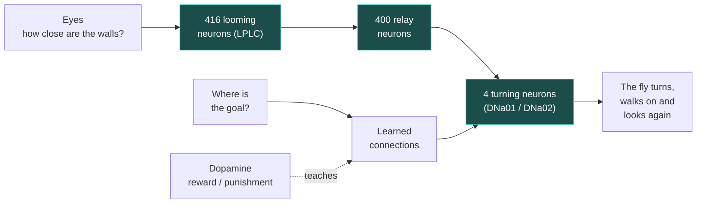
```mermaid
flowchart LR
    eyes["Eyes<br/>how close are the walls?"] --> lplc["416 looming<br/>neurons (LPLC)"]
    lplc --> relay["400 relay<br/>neurons"]
    relay --> dna["4 turning neurons<br/>(DNa01 / DNa02)"]
    dna --> move["The fly turns,<br/>walks on and<br/>looks again"]
    goal["Where is<br/>the goal?"] --> learned["Learned<br/>connections"]
    learned --> dna
    dopamine["Dopamine<br/>reward / punishment"] -. teaches .-> learned

    classDef real fill:#1b4d4a,stroke:#3fc8c0,color:#ffffff
    class lplc,relay,dna real
```

The three teal boxes are **real neurons from the connectome**, joined by their real connections (about 54,000).
Each neuron is simulated 1,000 times per simulated second as a simple *leaky integrate-and-fire* unit: it adds up
its inputs, and when it's charged enough it fires and resets. The learning layer and the dopamine are our model of
how real flies learn. They are not from the map.

<a name="try-it"></a>


| What | How | Needs |
|---|---|---|
| **Walk, fetch and learn** | Double-click [`experiments/carry-walk-sim/run.bat`](experiments/carry-walk-sim/), or open `web/index.html` in that folder | Just a browser |
| **Wall dodge, 3D replay** | Open [`wall_dodge_3d.html`](experiments/wall-dodge/output/web/wall_dodge_3d.html) | Just a browser |
| **Wall dodge, run it again** | Double-click `experiments/wall-dodge/run.bat` | Python, and a 1.9 GB download it does for you |
| **The wiring check** | `python experiments/connectivity-check/scripts/run_check.py` | Python and the data (below) |

The connectome data is too big for the repository (24 GB in total), so it's downloaded from Janelia into `data/`:

```bash
pip install -r requirements.txt
python data/download_data.py --core
```

`--core` gets the 1.9 GB that everything except the wiring check's 3D view needs.
[More about the experiments and the data →](experiments/)

<details>
<summary><b>What's in this repository</b></summary>

```
Echo-Fly/
  README.md               this page
  requirements.txt        Python packages
  data/                   the connectome (downloaded, not in git) + download_data.py, explore.py
  experiments/
    connectivity-check/   is the wiring there at all?
    wall-dodge/           the first demo: dodge walls, 3D replay
    carry-walk-sim/       paint a map, walk A to B or carry a load, learn with dopamine
  assets/readme/          images used on this page
```

</details>

<a name="where-were-going"></a>


<p align="center">
  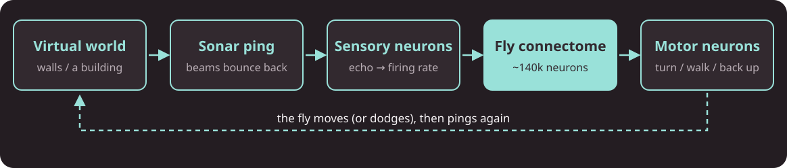
</p>

The plan is to swap the eyes for **sonar**. The fly sends out a few "beams", measures how far each one travels
before it hits a wall, and turns those echoes into activity in its sensory neurons. The hearing neurons are the
natural candidate, and the wiring check shows they reach the turning neurons in 2 synapses too. A first sonar
prototype, *Echo Room*, is on the [`raycast-v1`](https://github.com/Izu83/Echo-Fly/tree/raycast-v1/RayCastV1)
branch. It isn't connected to the fly brain yet.

If that works, the next test is a **building escape**: the fly starts blind inside a maze and has to find the exit
using only its sonar (and maybe a "smell" of fresh air from the exit).

- [x] Get the fly connectome and check that the senses are wired to the movement neurons
- [x] Wall dodge: a real piece of the brain steers the fly, with the swapped-wire control
- [x] A map you paint: walk A to B and carry a load, learning with dopamine
- [x] Browser sonar prototype (Echo Room, on the [`raycast-v1`](https://github.com/Izu83/Echo-Fly/tree/raycast-v1/RayCastV1) branch)
- [ ] Replace the eyes with sonar echoes and wire them into the fly brain
- [ ] Test the steering-direction assumption with stronger controls
- [ ] Get an existing whole-brain fly model running and reproduce one of its published results
- [ ] *(Maybe)* Building escape
- [ ] Poster and video

<a name="limitations"></a>


- **This is not a fly that echolocates, yet.** The fly steers with its eyes, using a simple hand-made "looming"
  signal.
- **It's a small piece of the brain.** 820 neurons out of about 200,000, each one a very simple model. Real neurons
  are far more complicated.
- **The steering direction is an assumption.** We assume a turning neuron turns the fly toward its own side. We
  haven't tested it, and the results depend on it.

<details>
<summary><b>More limitations</b></summary>

- **The learning is our model.** The goal-direction cells, the learned connections and the dopamine rule are not
  from the connectome. They are modelled on how the fly's learning centre (the mushroom body) is thought to work.
- **Some numbers were tuned by hand**, such as how strong the eye input is and one overall connection strength,
  so that the small circuit works.
- **No body.** The fly is a dot that turns and walks. A real fly body (for example NeuroMechFly / FlyGym) is a
  possible later step.
- **We're students.** We're learning as we go, and some of what's written here may turn out to be wrong.

</details>

<a name="thanks"></a>


This project would be impossible without other people's work:

- **Janelia FlyEM and the Male CNS connectome team**, for the male fly brain and nerve cord connectome we use
  ([male-cns.janelia.org](https://male-cns.janelia.org/), licensed CC-BY).
- **FlyWire Consortium**, for the first whole-brain fruit fly connectome ([flywire.ai](https://flywire.ai)), and
  **Google Research** for the AI behind the neuron tracing. Dorkenwald et al. and Schlegel et al., Nature (2024).
- **Shiu et al.**, *"A Drosophila computational brain model reveals sensorimotor processing"*, Nature (2024), for
  showing a whole fly brain can be simulated on a laptop. Our neuron settings follow theirs (approximately).
- **NeuroMechFly / FlyGym** (EPFL), for the simulated fly body we might use later.
- **UKTC** and our teachers.
