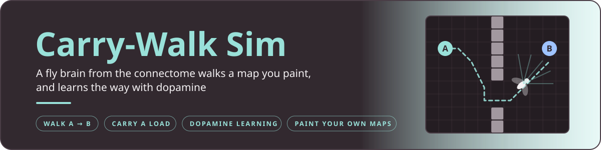
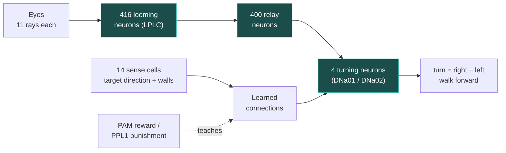

<p align="center">
  
</p>

<p align="center">
  
  
</p>

A simulated fly walks around a 2D map that **you paint**. It always walks forward, and the only thing that decides
where it turns is a piece of a **real fly brain**: 820 neurons cut from the male fly connectome (Janelia FlyEM,
CC-BY). It's the same circuit as in [`wall-dodge`](../wall-dodge/): looming neurons, relay neurons and turning
neurons.

There are two separate tasks, each in its own tab with its own map, its own fly brain and its own settings:

| Tab | The fly has to... |
|---|---|
| **Walk A → B** | walk from the start **A** to the goal **B** |
| **Carry** | walk to the **pickup**, take the load (which slows it down), and carry it to the **drop-off** |

A new fly has no idea where to go. It **learns** through **dopamine**: reward neurons (PAM) fire when things go
better than expected, and punishment neurons (PPL1) fire when it bumps into a wall. After a few attempts it knows
which way to turn.

<p align="center">
  
</p>
<p align="center"><sub>Before learning (left) and after 10 practice attempts (right), on the same map.</sub></p>

<a name="start"></a>


Double-click **`run.bat`**, or open **`web/index.html`** in a browser. It works offline and needs no install.

1. **Pick a tab:** Walk A → B or Carry.
2. **Pick a map** from the list under the map and press **Load**, or paint your own.
3. **Press Train** to let the fly practise at full speed, from 10 up to 1000 attempts. **Forget** wipes what it
   has learned.
4. **Press Run** (or Space) to watch one attempt. **Speed** goes up to 100×, and **Reset** (or R) starts over.

The page shows:
- **the map**, with the fly's eyes (coloured rays) and the path it walked;
- **the brain**, with its 820 neurons flashing as they fire, drawn where they sit in the fly;
- **the dopamine**, as live reward (PAM) and punishment (PPL1) bars;
- **the charts under the map**: success rate, time to finish, bumps, what the fly has learned over time, and the
  dopamine in the current attempt. Hover over them for exact numbers. **Heatmap** shows where the fly has walked
  across all attempts, and **Download attempts (CSV)** saves every attempt as a spreadsheet.

<a name="painting"></a>


| Tool | What it does |
|---|---|
| **Wall / Erase** | Drag to paint or erase walls. Right-drag always erases. **Brush** sets the size. |
| **Start (A)** | Click to place the start. Drag from it to set the direction the fly faces. |
| **Goal (B) / Pickup / Drop-off** | Click to place the marker. |
| **Undo (Ctrl+Z), Clear, Border** | Undo the last change, remove every wall, or add walls around the edge. |
| **New empty map** | Start from a blank map: 48 × 30, 64 × 40 or 96 × 60 cells. |
| **Save map / Open map** | Download the map as `.json`, or load one back. |

You can paint while the fly is running, for example to drop a wall right in front of it. Each tab remembers its
own map, settings and what the fly has learned, in the browser, between visits.

<a name="how-the-fly-works"></a>




The teal boxes are **real neurons from the connectome**. The rest is our model.

1. **Eyes.** Each eye looks from straight ahead out to its own side (100° by default) with 11 rays. The more of
   its view a wall fills, and the closer it is, the stronger the "looming" signal. That becomes up to 150 spikes
   per second into every looming neuron of that eye.
2. **Brain.** 416 looming neurons, 400 relays and the 4 turning neurons, joined by their 54,000 real connections.
   Whether a connection excites or inhibits comes from the neuron's predicted neurotransmitter. Every neuron is a
   *leaky integrate-and-fire* unit, simulated every millisecond (the same model as wall-dodge;
   `web/brain.js` is a port of `wall-dodge/scripts/brain.py`). No line of code says "turn away from walls": that
   comes out of the wiring.
3. **Turning.** Every 20 ms the fly turns at `0.06 rad/s × (right DNa − left DNa)`, at most 5 rad/s. It walks at a
   fixed 3 cells per second (a quarter slower while carrying). If it walks into a wall it slides along it, and the
   bump is counted.
4. **Finding the target.** The looming circuit has no idea where B, the pickup or the drop-off is. There are three
   options:
   - **Dopamine learning** (the default): the fly learns it, see below.
   - **Fixed compass**: a hand-made stand-in for the fly's navigation centre, which isn't in this circuit. It
     sends extra input to the turning neuron on the target's side.
   - **None**: only the connectome's wall avoidance.

   Either way, the connectome gets the last word. When an eye sees a wall close by, the looming pathway silences
   the opposite turning neuron, so avoiding the wall comes first.
5. **Spontaneous input.** Both turning neurons get a little random input, so the fly wobbles slightly and never
   freezes in a perfectly symmetric spot.

<a name="dopamine-learning"></a>


The fly has **14 sense cells**, connected to the turning neurons through connections that can change:

- **8 target-direction cells**, 45° apart. A cell fires when the current target (B, the pickup, or the drop-off
  once it carries the load) lies in its direction. With *Target sense = smell* the fly senses it through walls;
  with *sight*, only when nothing is in between.
- **6 wall cells**: the front, middle and side of each eye, driven by how close walls are.

A new fly starts with small random connections, so it has no preference. Then, every 20 ms:

1. **Tag.** A connection gets tagged when its cell was active and the fly turned toward that connection's side
   (and tagged negatively when it turned the other way). Tags fade over about 0.6 s.
2. **Dopamine.** The fly compares how things are going with how they usually go:
   - **PAM (reward)** fires when it's better than expected: getting closer to the target, a wall moving away. It
     fires a big burst when the fly grabs the load or arrives.
   - **PPL1 (punishment)** fires when it's worse: walking away from the target, a wall looming up, and a burst on
     every bump.
3. **Two compartments.** As in the fly's learning centre (the mushroom body), each signal only reaches its own
   connections. The target signal only teaches the target-direction connections, and the wall signal only teaches
   the wall connections. Without this split, maps where the fly must walk *away* from the goal to find a door
   (like *Two rooms*) made one kind of lesson erase the other, and training fell apart.
4. **Learn.** Each connection changes by `learning rate × (PAM − PPL1 of its compartment) × tag`, and stays
   between 0 and 200 Hz.

So a turn followed by good news happens more often in that situation, and a turn followed by a bump happens
less. The fly learns *"target on my right → turn right"* and, with the built-in wall avoidance switched off,
*"wall on my left → turn right"*. What it learned is kept between attempts and can be saved as a *memory* file.

**Where this comes from.** In real flies, PAM dopamine neurons signal reward, PPL1 dopamine neurons signal
punishment, and dopamine changes the connections that were just active (a *three-factor rule*). The sense cells
and learned connections here are a model of that idea. They are **not** neurons from the connectome: only the
820-neuron looming circuit is.

<a name="results"></a>


**Does it learn?** 10 test runs per map from the map's start, one fly per map. The graphs of these runs, and of
flies trained for 300 attempts, are in [`output/graphs/`](output/graphs/).

| Map | Can't learn (naive) | After 10 practice attempts | After 20, no built-in wall avoidance |
|---|---|---|---|
| Walk: Open room | 10/10 (46 s) | 10/10 (20 s) | 10/10 (19 s) |
| Walk: Pillars | 10/10 (60 s) | 10/10 (20 s) | 10/10 (21 s, 1.8 bumps) |
| Walk: Wall in the way | 6/10 (71 s) | 10/10 (19 s) | 10/10 (21 s) |
| Walk: Two rooms | 0/10 | 10/10 (31 s) | 7/10 (30 s, 4.9 bumps) |
| Walk: Zigzag | 10/10 (72 s) | 10/10 (54 s) | 1/10 |
| Carry: Open floor | 0/10 | 10/10 (34 s) | 10/10 (34 s) |
| Carry: Warehouse | 0/10 | 10/10 (41 s) | 10/10 (55 s, 7.8 bumps) |
| Carry: Fetch from next room | 0/10 | 10/10 (53 s) | 2/10 |
| Carry: Pillar field | 3/10 (100 s) | 10/10 (49 s) | 6/10 (54 s) |
| **Total** | **39/90** | **90/90** | **66/90** |

- **Learning works.** After 10 practice attempts the fly makes it every time, on every map, with about one bump or
  fewer per run. It's faster than the fixed compass on *Wall in the way* (19 s vs 39 s), *Zigzag* (54 s vs 72 s)
  and *Fetch from next room* (53 s vs 101 s).
- **The naive fly** only makes it when its random start happens to point roughly the right way, or when it
  bumbles into the target. It almost never manages the carry tasks, which need two targets.
- **Walls learned from scratch.** With the built-in wall avoidance off, the fly learns to avoid walls from
  punishment alone and succeeds 66/90, with many more bumps. Maps where it has to walk away from the target to
  get around a wall (*Zigzag*, *Fetch from next room*) are mostly too hard.
- **Long training stays stable.** Flies trained for 300 attempts kept succeeding the whole time; Zigzag and Fetch
  from next room dipped to 90–95% for a few attempts.

<details>
<summary><b>Checks: is it really the wiring doing the work?</b></summary>

Here the fixed compass gives the direction, and each check changes one thing. **Swapped eyes** plugs each eye into
the wrong side of the brain. **No compass** leaves only the connectome steering.

| Map | Fixed compass, real wiring | Swapped eyes | No compass |
|---|---|---|---|
| Walk: Open room | 10/10 (17 s) | 10/10 | 6/10 |
| Walk: Pillars | 10/10 (20 s) | 0/10 | 2/10 |
| Walk: Wall in the way | 10/10 (39 s) | 0/10 | 5/10 |
| Walk: Two rooms | 10/10 (36 s) | 0/10 | 2/10 |
| Walk: Zigzag | 10/10 (72 s) | 0/10 | 0/10 |
| Carry: Open floor | 10/10 (28 s) | 10/10 | 0/10 |
| Carry: Warehouse | 10/10 (35 s) | 0/10 | 0/10 |
| Carry: Fetch from next room | 10/10 (101 s) | 0/10 | 0/10 |
| Carry: Pillar field | 10/10 (45 s) | 0/10 | 1/10 |

- **The looming wiring does the obstacle avoidance.** With the eyes swapped, the fly steers into walls and gets
  stuck at the first one. It only succeeds on the two maps with nothing in the way.
- **The compass (or learning) supplies the direction.** Without it the fly avoids walls but wanders, and reaches a
  target only by chance.

</details>

<details>
<summary><b>Caveats</b></summary>

- The compass, the sense cells and the learned connections are not from the connectome. The dopamine rule is a
  simple model of mushroom-body learning, not a simulation of the real mushroom body.
- The tuning numbers (eye model, compass strength, turning gain, learning rate, the 200 Hz ceiling) were chosen by
  hand so that the ready-made maps work.
- The fly always senses which direction its target is in (by smell, or by sight if you choose that). What it
  has to learn is what to do with that information.
- The circuit is about 800 of about 200,000 neurons, which is why it needs one overall connection strength
  (gain) of 2.
- A fly like this reacts to what it sees and has no memory of where it has been, so it can still get trapped in
  dead ends that point toward the target, such as a U-shaped wall.

</details>

<a name="files"></a>


```
carry-walk-sim/
  run.bat                 opens the simulation (Windows)
  web/
    index.html            the page: map painter, both tasks, brain view, charts
    app.js                page logic, painting, drawing
    sim.js                the 2D world, the eyes, one run of the fly (tasks, pickup, drop-off)
    brain.js              the spiking circuit (leaky integrate-and-fire, 1 ms steps)
    learning.js           dopamine learning: sense cells, learned connections, PAM / PPL1, the rule
    charts.js             the charts on the page
    presets.js            ready-made maps
    brain_data.js         the 820-neuron circuit from the connectome (generated, see below)
    style.css
  output/
    gifs/                 the recordings on this page
    graphs/               charts of the results: learning over 300 attempts, naive vs trained
  scripts/
    export_brain.py       rebuilds web/brain_data.js from wall-dodge's circuit
    batch_run.js          runs maps many times without the browser and prints success rates
```

**Batch runs** (need [Node.js](https://nodejs.org)):

```bash
node scripts/batch_run.js                          # every ready-made map, 10 runs each (learning fly)
node scripts/batch_run.js --train 10               # practise 10 attempts per map first, then test
node scripts/batch_run.js --learnRate 0            # a naive fly that can't learn
node scripts/batch_run.js --steering compass       # the fixed compass instead of learning
node scripts/batch_run.js --map walk-map.json      # your own map, saved with "Save map"
node scripts/batch_run.js --wiring swapped         # the swapped-eyes check
node scripts/batch_run.js --innate 0 --runs 30     # any setting can be changed like this
```

**Rebuilding the brain file.** `web/brain_data.js` is already included. It only needs rebuilding if the wall-dodge
circuit changes (`experiments/wall-dodge/scripts/build_subnetwork.py`, which needs the connectome data, see
[Getting the data](../README.md#getting-the-data)):

```bash
python scripts/export_brain.py
```

The connectome data is licensed CC-BY: credit Janelia FlyEM and the Male CNS connectome team if you reuse it.
